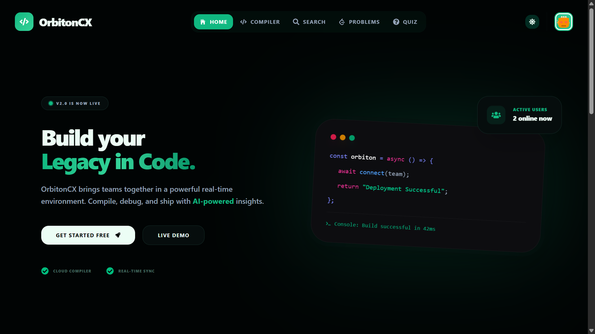
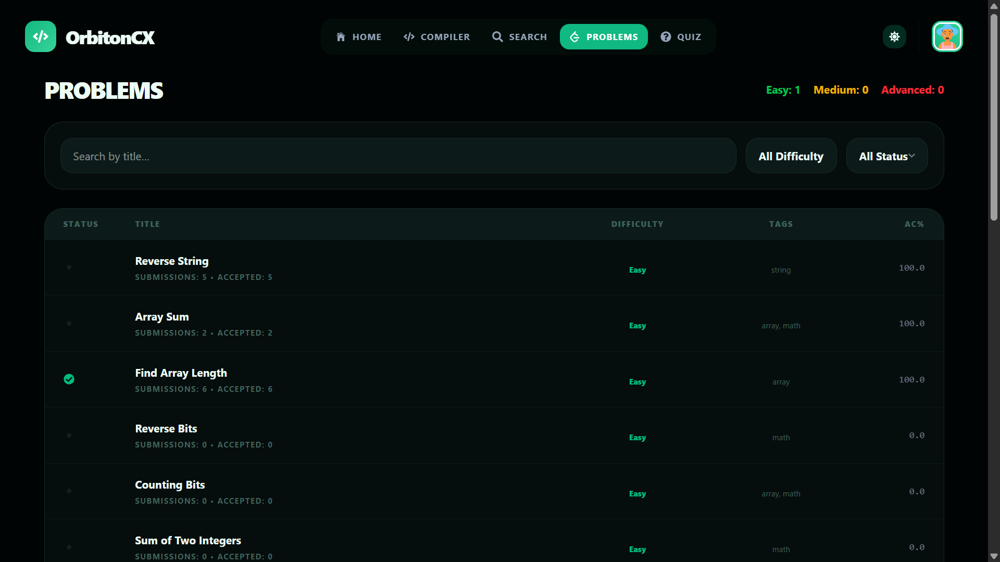
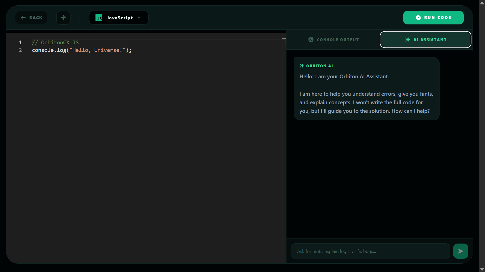
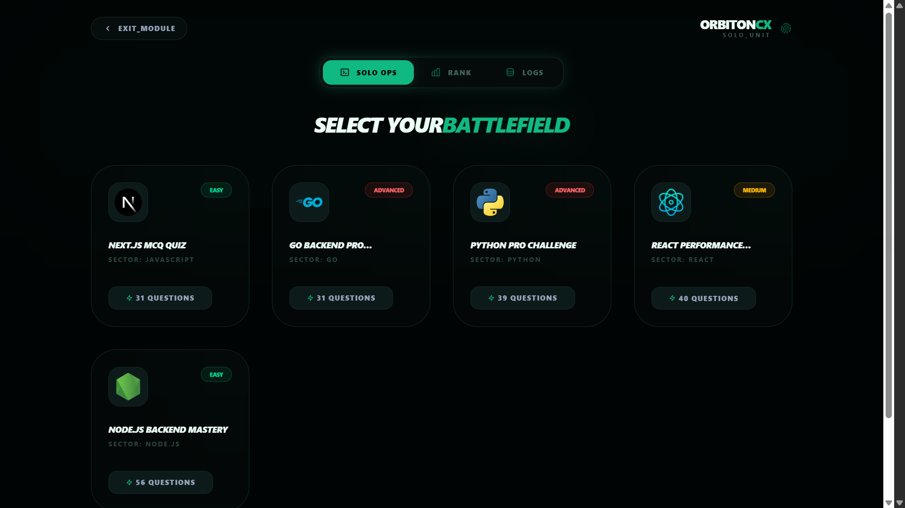
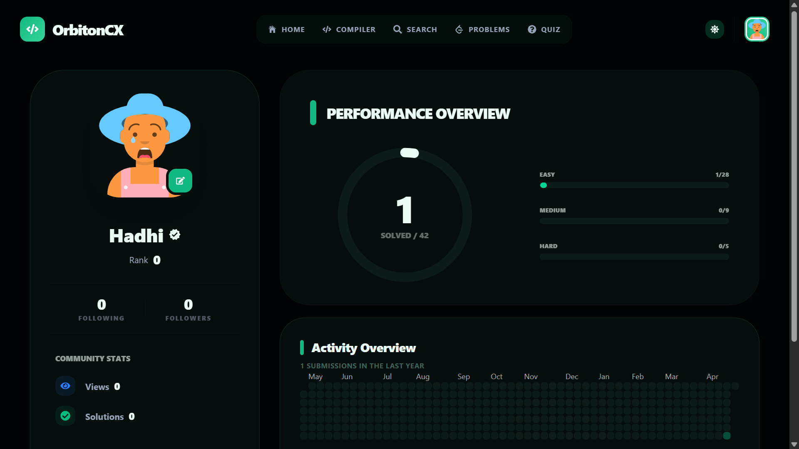
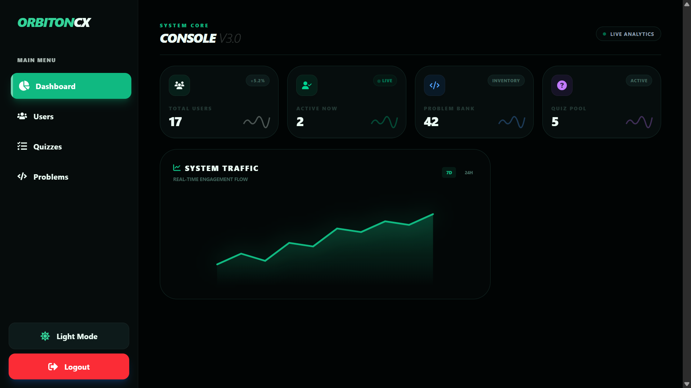

# 🚀 OrbitOnCX

<div align="center">



### 🧠 Practice Coding • ⚡ Run Code • 🏆 Compete • 📈 Track Progress

A **full-featured LeetCode-style coding platform** built with the **MERN stack**, combining problem solving, real-time collaboration, quizzes, and an online compiler.

[🌐 Live Demo](https://orbiton-cx.vercel.app) • [📂 Backend](https://your-backend.onrender.com)

</div>

---

## ✨ Overview

**OrbitOnCX** is a modern coding platform designed to simulate real-world interview preparation.

It provides:

* 💻 Coding practice environment
* ⚡ Real-time code execution
* 🏆 Competitive quizzes
* 📊 Progress tracking
* 💬 Real-time discussions
* 🛠️ Admin management system

---

## 🔥 Key Features

### 🧠 Coding Problem System

* Easy / Medium / Hard problems
* Structured problem descriptions
* Examples, constraints, hints
* Visible + Hidden test cases
* LeetCode-style verdicts:

  * ✅ Accepted
  * ❌ Wrong Answer
  * ⏱️ Time Limit Exceeded
  * ⚠️ Compilation Error
  * 💥 Runtime Error

---

### ⚡ Online Compiler

* Monaco Editor (VS Code-like)
* Multi-language support
* Judge0 API integration
* Custom input (`stdin`)
* Fast execution feedback

---

### 🏆 Quiz Arena

* MCQ-based quizzes
* Difficulty-based distribution
* Leaderboard system 🥇
* XP scoring
* Attempt history tracking

---

### 👤 User Profile

* 📅 GitHub-style activity heatmap
* 🔥 Daily streak tracking
* 📊 Solved problems analytics
* 🧮 Difficulty-wise breakdown
* 👥 Followers / Following

---

### 💬 Real-Time System

* Problem discussions
* Live updates (Socket.IO)
* Online/offline presence tracking
* Redis-powered sessions

---

### 🔐 Authentication & Security

* JWT authentication
* HTTP-only cookies
* Refresh token flow
* Protected routes
* Redis-based session handling

---

### 🛠️ Admin Dashboard

* User management
* Problem CRUD
* Draft / Publish system
* PDF problem upload parser
* Quiz management
* Analytics & stats

---

## 🧑‍💻 Tech Stack

### Frontend

* ⚛️ React + Vite
* 🎨 Tailwind CSS
* 🧠 Redux Toolkit
* 📝 Monaco Editor
* 🎬 Framer Motion

### Backend

* 🟢 Node.js + Express
* 🍃 MongoDB + Mongoose

### Services

* 🔌 Socket.IO
* ⚡ Redis
* ☁️ Cloudinary
* 🧪 Judge0 API

---

## 📸 Screenshots

### 🏠 Home


### 💻 Problem Solver



### ⚡ Compiler



### 📊 Quiz


### 📊 Profile



### 🛠️ Admin Dashboard



---

## 📁 Project Structure

```
OrbitOnCX/
│
├── frontend/        # React App
├── backend/         # Express API
│
├── controllers/     # Business logic
├── models/          # Mongo schemas
├── routes/          # API routes
├── middleware/      # Auth & error handling
├── sockets/         # Real-time logic
├── services/        # External integrations
└── utils/           # Helpers
```

---

## 🔐 Environment Variables

### Backend

```
PORT = 5000
MONGODB_URI=

JWT_SECRET_KEY=
JWT_ACCESS_SECRET=
JWT_REFRESH_SECRET=

CLOUDINARY_CLOUD_NAME=
CLOUDINARY_API_KEY=
CLOUDINARY_API_SECRET=

NODE_ENV=
EMAIL=
EMAIL_PASS=

FRONTEND_URL=http://localhost:5173
ADMIN_EMAIL=
REDIS_URL=


GROQ_API_KEY=
GROQ_MODEL=


### Frontend

```
VITE_BACKEND_URL=https://your-backend-url
VITE_GOOGLE_CLIENT_ID=your_google_client_id
```

---

## ⚙️ Installation

```bash
git clone https://github.com/Shifin-Malik/OrbitOnCX.git
cd orbitoncx

# frontend
cd frontend
pnpm install

# backend
cd ../backend
pnpm install

# run
pnpm dev
```

---

## 🚀 Future Enhancements

* 🤖 AI Code Assistant
* 🏁 Contest Mode
* 📱 Mobile App
* 🌍 Multi-language support
* 🔔 Notifications system

---

## 🤝 Contributing

```bash
git checkout -b feature/your-feature
git commit -m "feat: add new feature"
git push origin feature/your-feature
```

Pull requests are welcome ❤️

---

## 👨‍💻 Author

**Shifin Malik**
MERN Stack Developer
Kerala, India 🇮🇳

---

## ⭐ Support

If you like this project, give it a ⭐ on GitHub!

---

<div align="center">

🔥 Built with passion for developers

</div>
